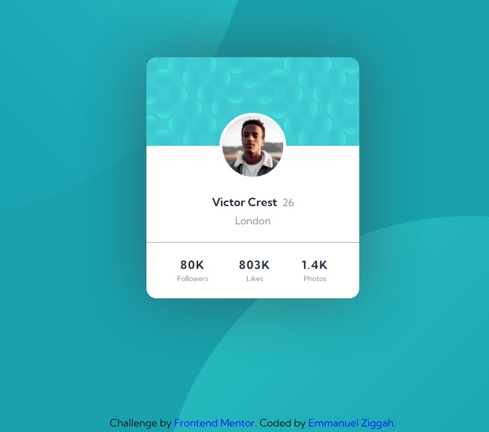

# Frontend Mentor - Profile card component solution

This is a solution to the [Profile card component challenge on Frontend Mentor](https://www.frontendmentor.io/challenges/profile-card-component-cfArpWshJ). Frontend Mentor challenges help you improve your coding skills by building realistic projects. 

## Table of contents

- [Overview](#overview)
  - [The challenge](#the-challenge)
  - [Screenshot](#screenshot)
  - [Links](#links)
  - [Built with](#built-with)
  - [Continued development](#continued-development)
- [Author](#author)

### The challenge

- Build out the project to the designs provided

### Screenshot

### Links

- Live Site URL: [https://victor-crest-profile-preview.netlify.app/]

### Built with

- Semantic HTML5 markup
- CSS custom properties
- Flexbox
- CSS Grid
- Mobile-first workflow

### Continued development
I will start learning Sass and tailwaind.css for my css journey 

## Author
- Frontend Mentor - [@blackcoderx](https://www.frontendmentor.io/profile/blackcoderx)
- Twitter - [@blackcoderx](https://www.twitter.com/blackcoderx)

